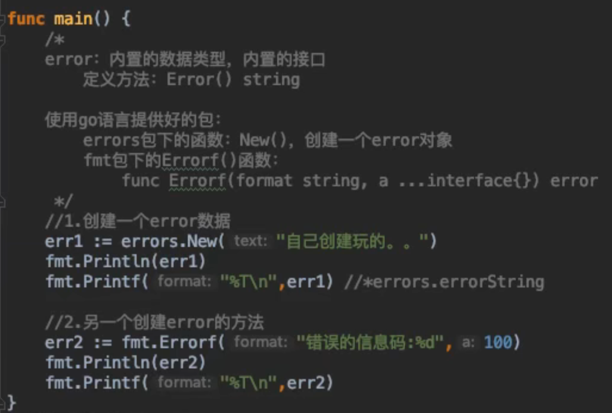
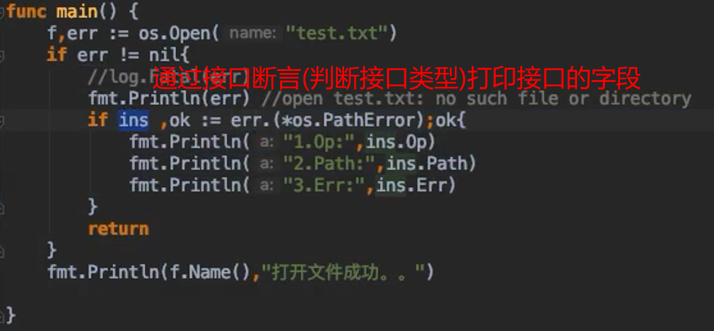
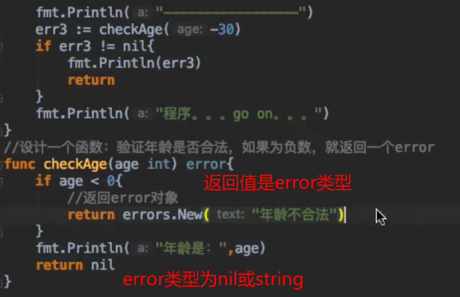
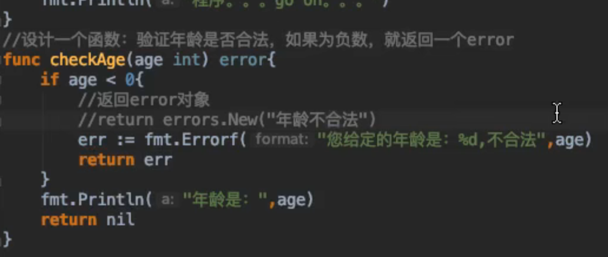

# Go error 错误
在实际工程项目中，我们希望通过程序的错误信息快速定位问题，但是又不喜欢错误处理代码写的冗余而又啰嗦。Go语言没有提供像`Java`、`c#` 语言中的 `try..catch` 异常处理方式，而是通过 **函数返回值** 逐层往上抛。这种设计，鼓励工程师在代码中 **显式的检查错误** ，而非忽略错误，好处就是避免漏掉本应处理的错误。但是带来一个弊端，让 **代码啰嗦** 。

## 错误&异常
- **错误**: 指的是**可能出现问题**的地方出现了问题。比如打开一个文件时失败，这种情况在人们的意料之中。  
- **异常**: 指的是不**应该出现问题**的地方出现了问题。比如引用了空指针，这种情况**在人们的意料之外**。可见，错误是业务过程的一部分，而异常不是。  

Go中的错误 **也是一种类型** 。错误用内置的 `error` 类型表示。就像其他类型的，如`int`,`floate64`.错误值可以**存储在变量中，从函数中返回**，等等。

## 处理 OS 模块异常
如果一个函数或方法返回一个错误，那么按照惯例，它必须是 **函数返回的最后一个值**。因此，`Open` 函数返回的值是最后一个值。  
处理错误的惯用方法是将 **返回的错误与 `nil` 进行比较** 。`nil` 值表示没有发生错误，而 `非nil` 值表示出现错误。在我们的例子中，我们检查错误是否为`nil`。如果它不是 `nil` ,我们只需 **打印错误并从主函数返回**。

```go
package main
import (
"os"
"fmt"
"log"
)

func main() {
    //打开一个文件
    f,err :os.Open(name:"test.txt")
    if err != nil{
        //log.Fatal(err)  //调用日志模块捕捉异常,会自动 return
        fmt.Println(err) //异常信息:open test.txt:no such file directoryreturn
        return
    }

  fmt.Println(f.Name(),"打开文件成功。。")

}
```

## 错误类型表示
G0语言通过 **内置的错误接口** 提供了非常简单的错误处理机制。  
**定义错误类型** 的构建。错误是一个带有以下定义的接口类型:  
```go
type error interface {
    Error() string
}
```    
> `fmt.Println(err)` 会在内部执行 Error() 方法,返回错误的字符串信息.  

  

### 从错误中获取更多信息
> **断言判断接口底层类型** ,通过 `struct` 结构体的属性和方法获取更多的信息

#### 使用 `struct` 类型属性

  

#### 调用 `struct` 类型的方法

  

#### 直接比较
直接与错误类型的变量进行比较.     
```go
package main
import (
"path/filepath"
"fmt"
)
func main() {
  files,err := filepath.Glob("[")
  // 直接判断错误的类型
  if err != nil & err == filepath.ErrBadPattern{
    fmt.Println(err)//syntax error in patternreturn
    return
  }
  fmt.Println(a:"files:",files)
}
```


## 自定义 error

### 1. 通过 `errors.New("描述")`


### 2. 通过 `fmt.Errorf()`  
也可以使用 `fmt.Errorf()` 输出的错误更详细,支持格式化输出错误.  

  

### 3. 定义错误
```go
package main

import (
	"fmt"
	"math"
)

func main() {
	r := -2.0
	area, err := circleArea(r)
	if err != nil {
		// 打印 err 就是调用错误struct的Error()方法,返回字符串
        //错误值其实就是错误对象调用Error方法执行的结果
		// fmt.Println(err)
		// 通过接口断言判断错误类型,获取错误类型中的属性,运行错误类型中的方法
		if err, ok := err.(*areaError); ok {
			fmt.Println(err)
			fmt.Printf("半径是:%.2f\n", err.radius)
		} else {
			fmt.Println(err)
			fmt.Printf("其他错误类型:%s,%T\n", err, err)
		}
		return
	}
	fmt.Println("圆的的面积是:", area)
}

//1. 定义一个struct,表示错误类型
type areaError struct {
	msg    string // 错误的描述
	radius float64  //半径
}

//2. 实现error接口，就是实现Error方法，该方法返回字符串
// 需要传入结构体指针
func (e *areaError) Error() string {
	// 返回一个格式化的字符串
	return fmt.Sprintf("error: 半径,%.2f,%s", e.radius, e.msg)
}

// 3.定义一个求圆面积的函数,注意，第二个返回值是go内置的 error接口实现类型
func circleArea(r float64) (float64, error) {
	if r < 0 {
		// 用 & 返回error对象指针
		return 0, &areaError{"半径是非法的", r}
	}
	return math.Pi * r * r, nil
}
```

## 尽量不要 `_` 忽略错误
**永远不要忽略一个错误。忽视错误会招致麻烦。**
```go
files,_ := filepath.Glob("[")
```

## `panic()` 和 `recover()`
```go
package main

import "fmt"

func main() {
	// 处理 panic 的 defer 匿名函数
	defer func() {
		// reconver() 接受 panic() 的信息
		if msg := recover(); msg != nil {
			fmt.Println(msg, "程序恢复啦。。")
		}
	}()
	// funB的panic传递到此处,引起panic时需要执行完所有defer主函数才会报错
	funB()

}

func myprint(s string) {
	fmt.Println(s)
}

func funB() { //外围函数
	// 匿名函数,处理pianic的recover()也可以放在main函数中
	// defer是逆序执行的
	defer func() {
		// reconver() 接受 panic() 的信息
		if msg := recover(); msg != nil {
			fmt.Println(msg, "程序恢复啦。。")
		}
	}()

	fmt.Println("我是函数funB()..")
	defer myprint("defer funB()...1.....")
	for i := 1; i <= 10; i++ {
		fmt.Println("i:", i)
		if i == 5 {
			//让程序中断
			panic("funB函数,恐慌了")
		}
	}
	//当外围函数的代码中发生了运行恐慌，只有其中所有的已经`defer`的函数全部都执行完毕后，
	//该运行恐慌才会真正被扩展至调用处。
	defer myprint("defer funB():2.....")
}
```


## 什么时候使用错误/异常
什么情况下用错误表达，什么情况下用异常表达，就得有一套规则，否则很容易出现一切皆错误或一切皆异常的情况。  
以下给出异常处理的作用域（场景）:  

> 1. 空指针引用
> 2. 下标越界
> 3. 除数为0
> 4. 不应该出现的分支，比如default
> 5. 输入不应该引起函数错误  

其他场景我们使用错误处理，这使得我们的函数接口很精炼。对于异常，我们可以选择在一个合适的上游去`recover()` .并打印堆栈信息，使得部署后的程序不会终止。  
