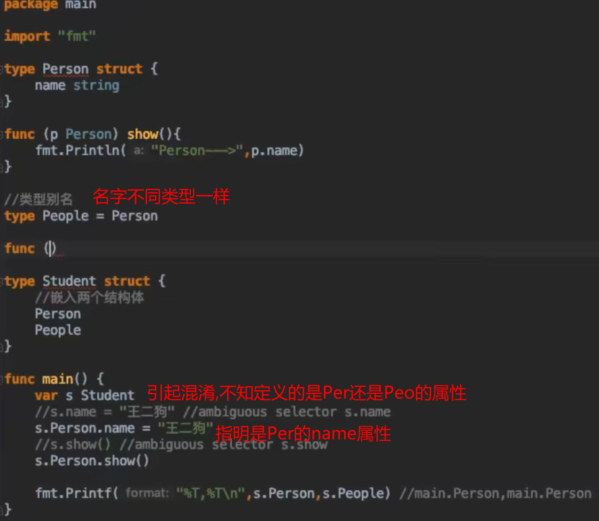

# Go Type关键字
`type` 是Go语法里的重要而且常用的关键字,`type` 绝不只是对应于C/C+中的 `typedef`.搞清楚 `type` 的使用,就容易理解Go语言中的核心概念 `struct`、`interface`、`函数` 等的使用。

## 通过 type 定义新类型

```go
type 类型名 Typde
type myint int  //定义了一共 `myint` 类型它是 `int` 类型
```
  

## 通过 type 定义函数类型
Go 语言支持 **高阶函数** ,所以可以把函数作为一个函数的返回值,或者一个函数的参数.
  

## 类型别名
常常用于代码迁移,适配新旧代码.

```go
//不是重新定义新的数据类型，只是给int起别名，和int可以通用,%T打印的类型还是int
type myint = int 
```

## 非本地类型不能定义方法
`time` 包下的 `Duration` 类型不是 `main` 包下的类型,所以不是本地类型.不能定义方法.

  

## 在结构体成员嵌入时使用别名
  

