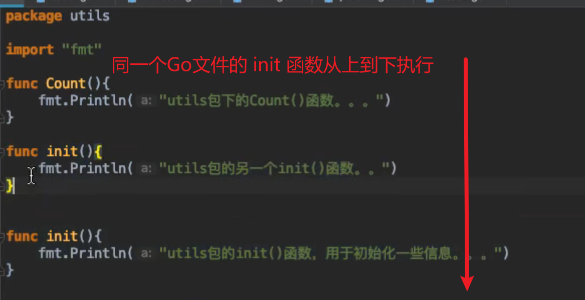
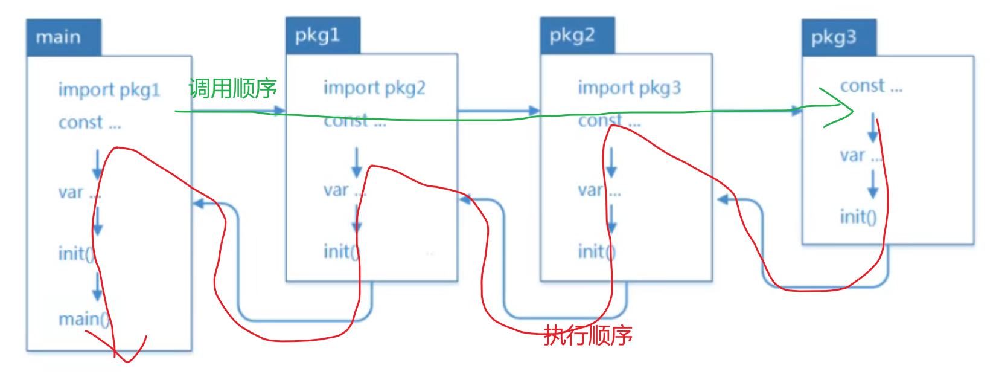

# Go 包的使用
关于包的使用:  
1. 一个目录下的文件归属一个包。`package` 的声明要一致  
2. package声明的包和对应的目录名可以不一致。但习惯上还是写成一致的  
3. 包可以嵌套  
4. 同包下的函数不需要导入包，可以直接使用  
5. main包，`main()` 函数所在的包，其他的包不能使用  
6. 导入包的时候，路径要从 `src` 下开始写  
7. **变量名大写** 表示该变量可以外部访问.

## `init()` 函数
`init()`、`main()` 是 Go 语言中的保留函数。我们可以在源码中，定义 `init()` 函数。此函数会在**包被导入时执行**，例如如果是在 `main()` 中导入包，包中存在 `init()`,那么 `init()` 中的代码会在 `main()` 函数执行前执行，用于初始化包所需要的特定资料.    

## 相同点
1. `init()` `main()` 函数不能有返回值也不能有参数.  
2. 两个函数在定义时不能有任何的参数和返回值,该函数只能由 Go 程序自动调用,不可以被引用.   

## 不同点
1. `init()` 可以应用于任意包中，且可以重复定义多个。  
2. `main()` 函数只能用于 `main` 包中，且只能定义一个。 

## 两个函数的执行顺序

1. 对于同一个 Go 文件,从上到下执行    
  

2. 对于同一个 package 中的不同文件,将文件名按字符串进行从小到大排序,之后顺序调用各文件中的 `init()` 函数.
  

3. 对于不同的 package,如果不相互依赖的话，按照 main 包中 import 的顺序调用其他包中的 `init()` 函数。    

4. 如果 package 存在依赖,调用顺序为最后被依赖的最先被初始化.  
例如：导入顺序 main->A->B->C ,则初始化顺序为 C->B->A->main ,一次执行对应的init方法。main包总是被最后一个初始化，因为它总是依赖别的包.   
  

5. 避免出现 **循环 import** ,例如：`A->B->C->A`.  
一个包被其它多个包 import ,.但只能被初始化一次  

## 总结
`init()` 函数和 `main()` 函数
1. 这两个函数都是go语言中的**保留函数**。`init()` 用于初始化信息，`main()` 用于作为**程序的入口**
2. 这两个函数定义的时候：**不能有参数，返回值**。只能由 Go 程序自动调用，**不能被引用**
3. `init()` 函数可以定义在任意的包中，可以有多个。`main()` 函数只能在 main 包下，并且**只能有一个**。
4. 执行顺序
   1. 先执行 `init()` 函数，后执行 `main()` 函数  
   2. 对于同一个 Go 文件中，调用顺序是**从上到下**的，也就是说，先写的先被执行，后写的后被执行  
   3. 对于同一个包下，将文件名按照字符串进行排序，之后顺序调用各个文件中 `init()` 函数  
   4. 对于不同包下.  
   如果不存在依赖，按照 main 包中 import 的顺序来调用对应包中   `init()` 函数如果存在依赖，**最后被依赖的最先被初始化**   
   导入顺序：main一>A一>B->C  
   执行顺序：C一>B->A一>main  
5. 存在依赖的包之间，不能循环导入   
6. 一个包可以被其他多个包 import ,但是 **只能被初始化一次**。  
7. `_` 操作，其实是**引入该包**，而不直接使用包里面的函数，仅仅是调用了该包里的 `init()`

## 注意

1. 如果仅仅需要导入包时执行**初始化操作**，并不需要使用包内的**其他函数**，常量等资源。则可以在导入包时，**匿名导入**。  
这个操作经常是让**很多人费解**的一个操作符  
```go
// 使用 `_`(空白标识符) 匿名导入.
import (
    "database/sql"
    _ "github.com/ziutek/mymysql/godrv"
)
```

2. 管理外部包  
Go 允许 import 不同代码库的代码。对于 import 要导入的外部的包，可以使用 `Go get` 命令取下来放到 `GOPATHS` 对应的目录中去。  
举个例子，比如说我们想通过 Go 语言连接 mysql 数据库，那么需要先下载 mysql 的数据包，打开终端并输入以下命令：  
```shell
go get github.com/go-sql-driver/mysql
```
安装之后，就可以在 `GOPATHS` 目录的 `src` 下，看到对应的文件包目录.   
> 如果有多个 `GOPATHS` 目录,默认下载到第一个目录下.

3. 我们可以通过 `go install` 来编译包文件。    
我们知道一个非main包在编译后会生成一个。a文件(在临时目录下生成)。除非使用go install安装到 `$GOROOT` 或 `$GOPATH` 下，否则你看不到a,用于后续可执行程序链接使用。   
比如Go标准库中的包对应的源码部分路径在：`$GROOT/src`,而标准库中包编译后的a文件路径在 `$GROOT/pkg/darwin_amd64` 下。   


