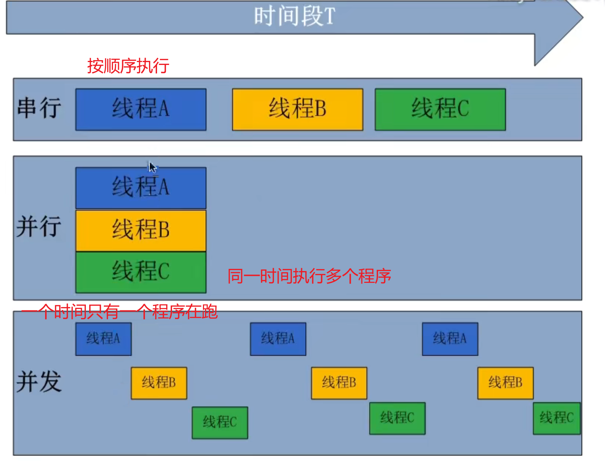
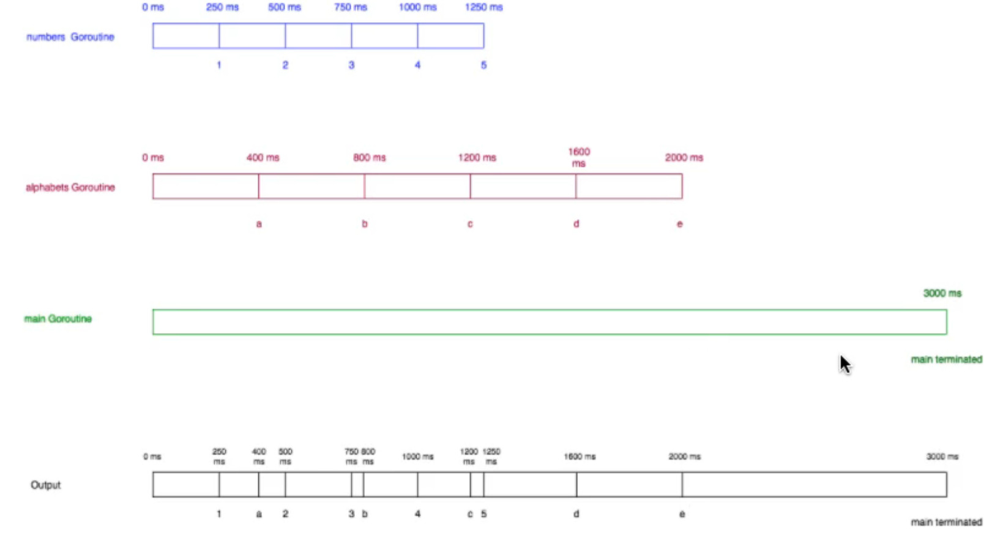

# Go 并发编程 Goroutine

## 并行和并发的区别
  

## 进程/线程/协程
进程(`Process`),线程(`Thread`),协程(`Coroutine`,也叫**轻量级线程**)   
- 进程:
  进程是一个程序在一个数据集中的一次动态执行过程，可以简单理解为“正在执行的程序”，它是**CPU资源分配和调度** 的独立单位。  
  进程一般由程序、数据集、进程控制块三部分组成。我们编写的程序用来描述进程要完成哪些功能以及如何完成；数据集则是程序在执行过程中所需要使用的资源；进程控制块用来记录进程的外部特征，描述进程的执行变化过程，系统可以利用它来控制和管理进程，它是**系统感知进程**存在的唯一标志。进程的局限是**创建、撤销和切换的开销比较大**。  

- 线程:
  线程是在进程之后发展出来的概念。线程也叫**轻量级进程**，它是一个基本的CPU执行单元，也是程序执行过程中.  
  的最小单元，由线程ID、程序计数器、寄存器集合和堆栈共同组成。**一个进程可以包含多个线程**。
  线程的优点是**减小了程序并发执行时的开销**，提高了操作系统的**并发性能**，缺点是**线程没有自己的系统资源**，只拥有在运行时必不可少的资源，但同一进程的各线程可以**共享进程所拥有的系统资源**，如果把进程比作一个车间，那么线程就好比是车间里面的工人。不过对于某些**独占性资源存在锁机制**，处理不当可能会产生**“死锁”**.  

- 协程:
  协程是一种**用户态的轻量级线程**，又称**微线程**，英文名 `Coroutine`,协程的调度完全由**用户控制**。人们通常将协程和子程序（函数）比较着理解。  
  子程序调用总是一个入口，一次返回，一旦退出即完成了子程序的执行。

**与传统的系统级线程和进程相比，协程的最大优势在于其"轻量级"，可以轻松创建上百万个而不会导致系统资源衰竭，而线程和进程通常最多也不能超过1万的。这也是协程也叫轻量级线程的原因。**

> 协程与多线程相比，其优势体现在：**协程的执行效率极高**。因为子程序切换不是线程切换，而是 **由程序自身控制**，因此，没有线程切换的开销，和多线程比，线程数量越多，协程的性能优势就越明显。  

## Go Goroutine

1. 当新的 `Goroutine` 开始时，`Goroutine` 调用**立即返回**。与函数不同，Go **不等待**`Goroutine` 执行结束。当 `Goroutine` 调用，并且 `Goroutine` 的任何返回值被**忽略之后**，go**立即执行到下一行代码**。   
2. main 的 `Goroutine`.应该为其他的 `Goroutines` 执行。如果main的`Goroutine`终止了，程序将被终止，而其他 `Goroutines` 将不会运行。(所以需要用 `channel` 通道进行通信)

## Main Goroutine 

此后，主 `goroutine` 会进行一系列的初始化工作，涉及的工作内容大致如下：  
1. 创建一个特殊的 `defer` 语句，用于在主 `goroutine` 退出时做必要的**善后处理**。因为主 `goroutine` 也可能**非正常**的结束  
2. 启动专用于在后台清扫内存垃圾的 `goroutine`,并设置 `GC` 可用的标识  
3. 执行mian包中的 `init` 函数   
4. 执行 `main` 函数   
执行完main函数后，它还会检查主 `goroutine` 是否引发了**运行时恐慌**，并进行**必要的处理**。最后主 `goroutine` 会**结束自己以及当前进程的运行**。

## Example Code

```go
package main

import (
	"fmt"
	"time"
)

func numbers() {
	for i := 1; i <= 5; i++ {
		time.Sleep(250 * time.Millisecond)
		fmt.Printf("%d ", i)
	}
}
func alphabets() {
	for i := 'a'; i <= 'e'; i++ {
		time.Sleep(400 * time.Millisecond)
		fmt.Printf("%c ", i)
	}
}

func main() {
	go numbers()
	go alphabets()
	time.Sleep(3000 * time.Millisecond)
	fmt.Println("main terminated")
}
```
Result:  
```shell
1 a 2 3 b 4 c 5 d e main terminated
```

同时启动 3 个 `Goroutine` ,时间轴分析:  
  

