# Go指针
`*指针类型`: 取指针地址对应的真实值. | 定义一个指针 `*p1`  
`&值`: 取值的内存地址.   
`var p *int`: 定义一个指向int类型的指针

## 指针初步
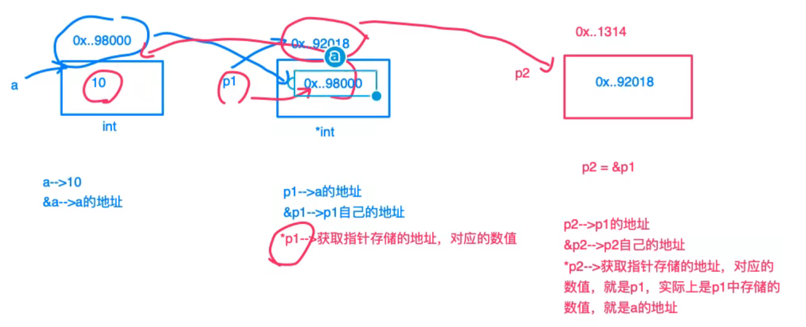  
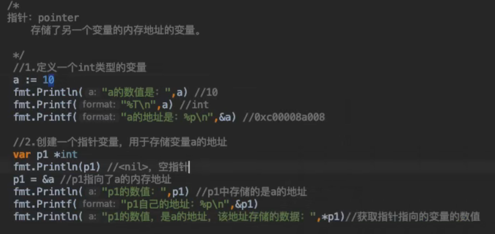  
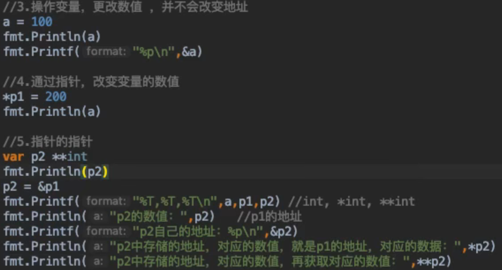  

---

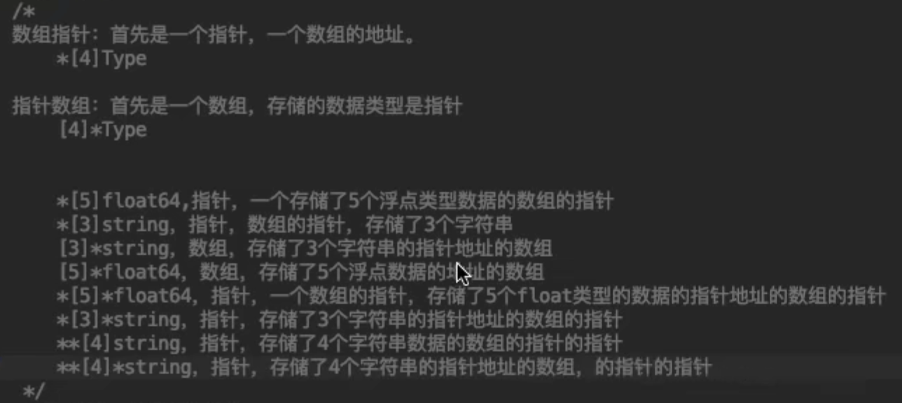  
## 数组指针
"首先是一个指针,一个数组的地址."  
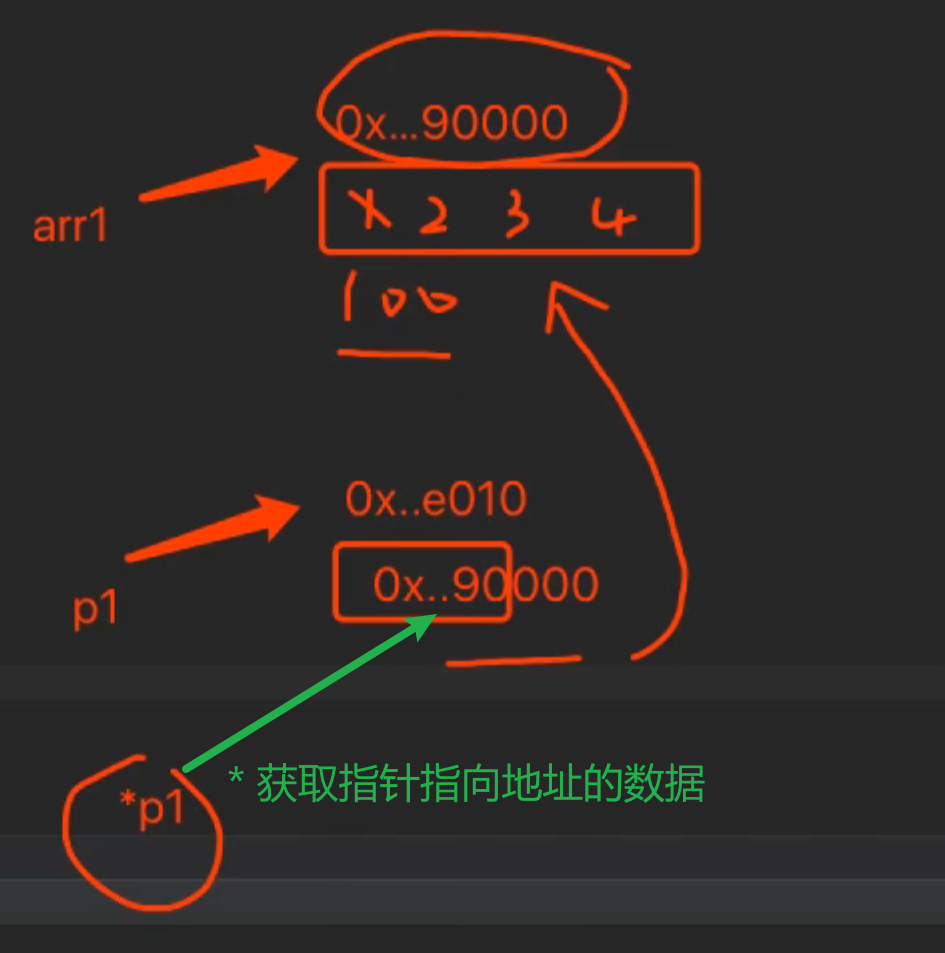  
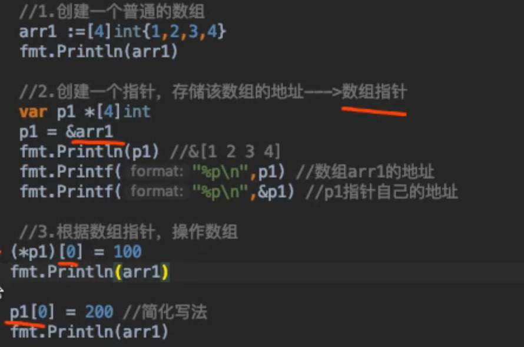  

## 指针数组
"首先是一个数组,存储的数据类型是指针."
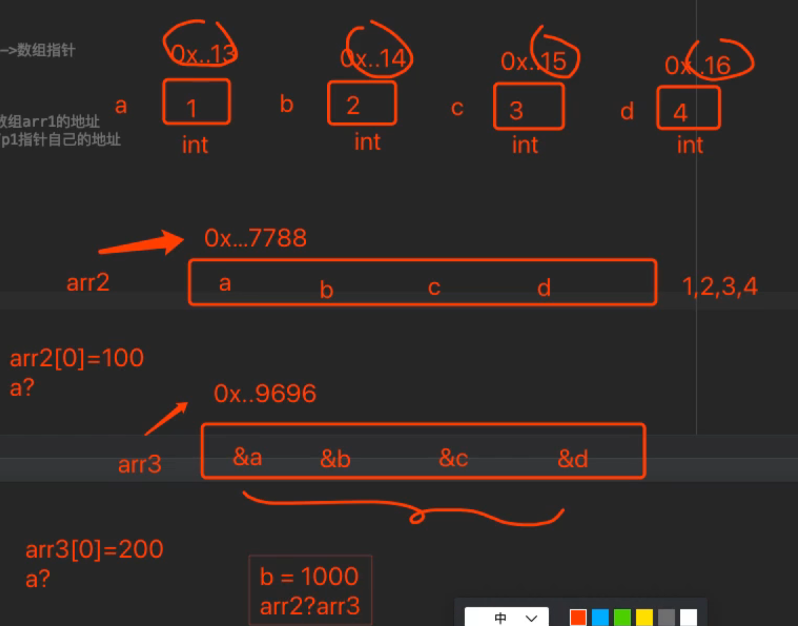  

## 函数指针
"一个指针,指向一个函数的指针."
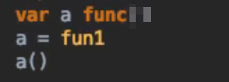  

## 指针函数
"一个函数,该函数的返回值是一个指针."
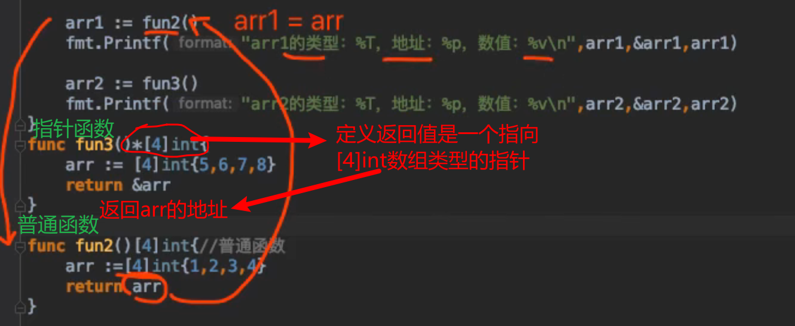  

### 普通函数的执行分析
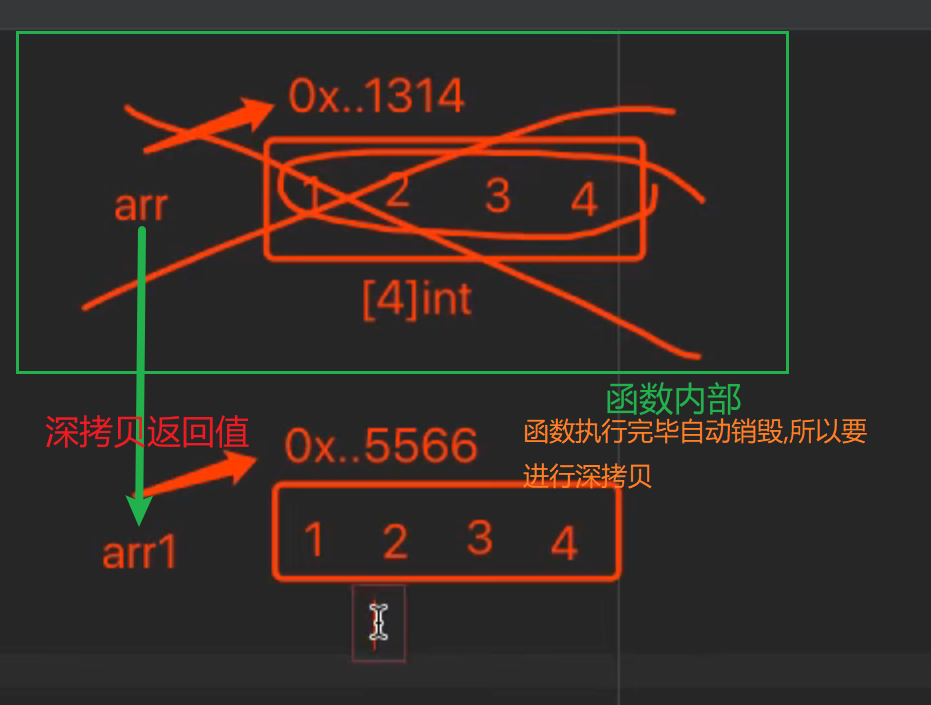  

### 指针函数的执行分析
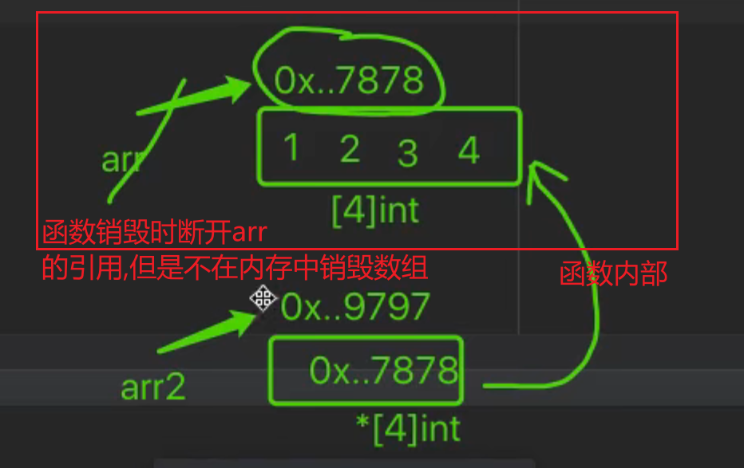  

## 指针作为参数

### 普通函数的值传递
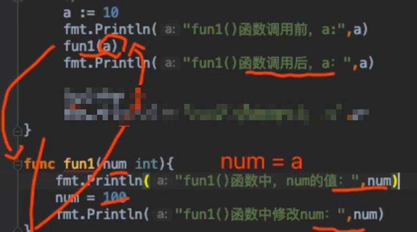  
  

### 指针作为参数时的引用传递
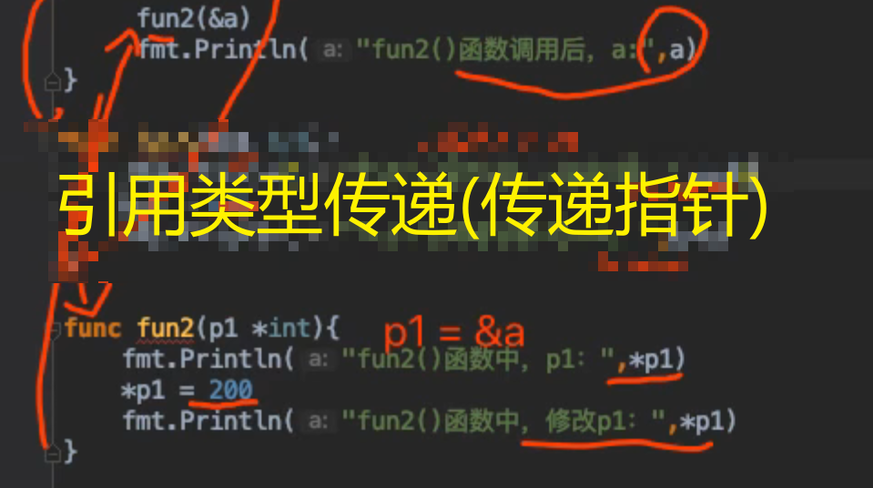  
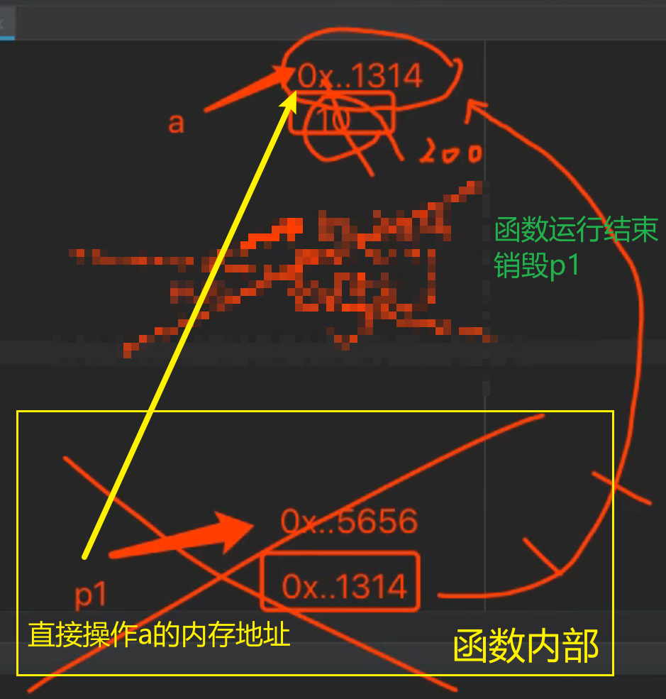  

### 应用
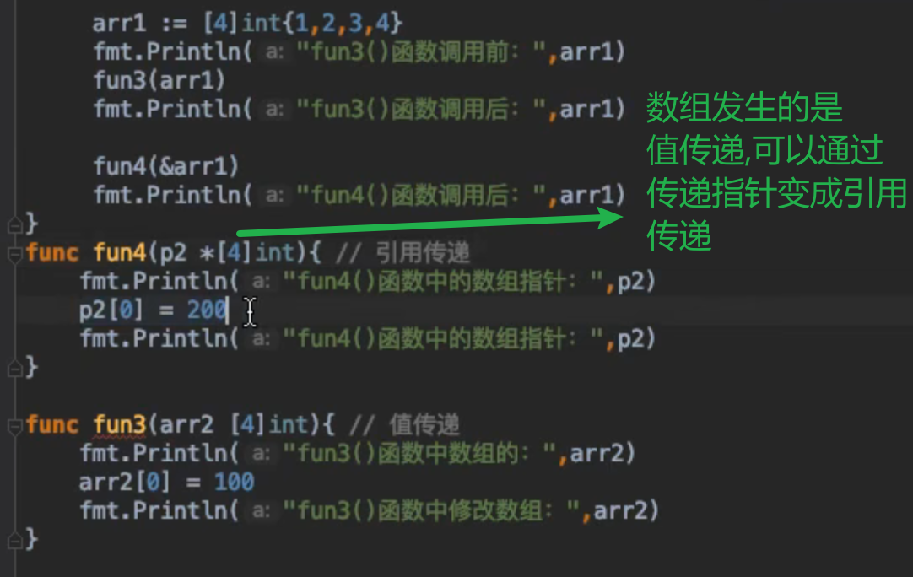  
  
> 切片本来就是 **引用类型**,**不必传递指针.**

```go
package main

import "fmt"

func main() {
   	fmt.Println("Hello, World!")
	s1 := []int{1,2,3,4}
	fmt.Printf("main()数值:%v 地址:%p\n", s1, s1)
	test(s1)
	fmt.Printf("执行完函数main()数值:%v 地址:%p\n", s1, s1)
}

func test(slice []int) {
	fmt.Printf("进入test()数值:%v 地址:%p\n", slice, slice)
	// 在函数内修改切片
	slice[0] = 10
	fmt.Printf("离开test()数值:%v 地址:%p\n", slice, slice)
}
```
output:  
切片地址都是一样的,切片发生的是引用传递
```
Hello, World!
main()数值:[1 2 3 4] 地址:0xc000098000
进入test()数值:[1 2 3 4] 地址:0xc000098000
离开test()数值:[10 2 3 4] 地址:0xc000098000
执行完函数main()数值:[10 2 3 4] 地址:0xc000098000
```
