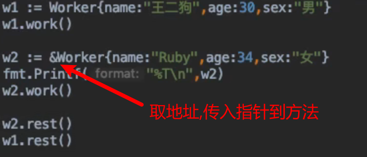
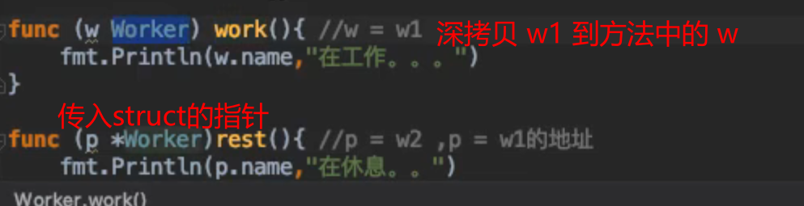
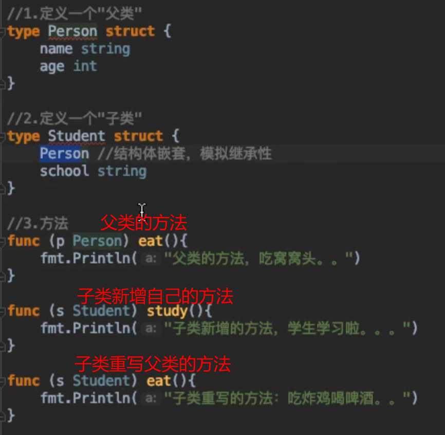
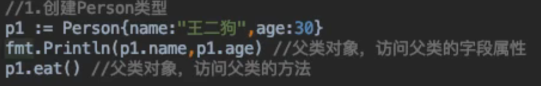
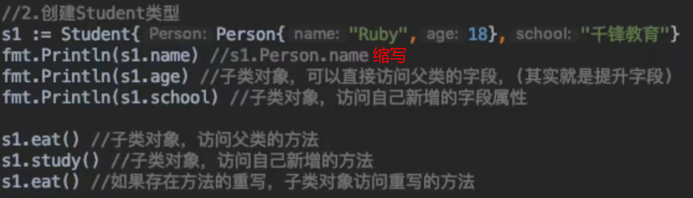

# Go 方法

G0语言中同时有函数和方法。一个方法就是一个**包含了接受者的函数**，接受者可以是**命名类型或者结构体类型**的一个**值**或者是一个**指针**。所有给定类型的方法属于**该类型的方法集**.  
方法只是一个**函数**，它带有一个**特殊的接收器类型**，它是在 `func` 关键字和方法名之间编写的。接收器可以是 `struct` 类型或非 `struct` 类型。**接收方可以在方法内部访问**。  

## 对比函数
- 意义  
方法：某个类别的行为功能，需要**指定的接受者调用**.  
函数：一段**独立功能**的代码，可以直接调用.  
- 语法  
方法：方法名可以相同，只要接受者不同.  
函数：命名不能冲突.  
> 方法可以模拟 `class` 继承结构.  

## 定义一个方法
语法:  
```go
func (接收者) 方法名(参数列表)(返回值列表){
    // do..something..
}
```

### 接收者为一个值
  

### 接收者为一个指针
  
  

## 方法的继承性

### OOP继承
如果两个类(class)存在**继承关系**，其中一个是子类，另一个作为父类，那么：
1. 子类可以**直接访问**父类的属性和方法
2. 子类可以**新增**自己的属性和方法
3. 子类可以**重写**父类的方法(就是将父类已有的方法，**重新实现**)

### 示例
`method` 是可以继承的，如果匿名字段实现了一个`method`,那么包含这个匿名字段的 `struct` 也能调用该 `method`  
  
  
  
