# Go 结构体
**结构体:** 是由一系列具有 **相同类型** 或 **不同类型** 的数据构成的数据 **集合**.  
结构体成员是由 **一系列的成员变量** 构成，这些 **成员变量** 也被称为 **字段**

## 定义一个结构体
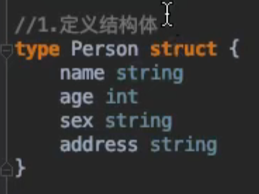  
初始化结构体:  
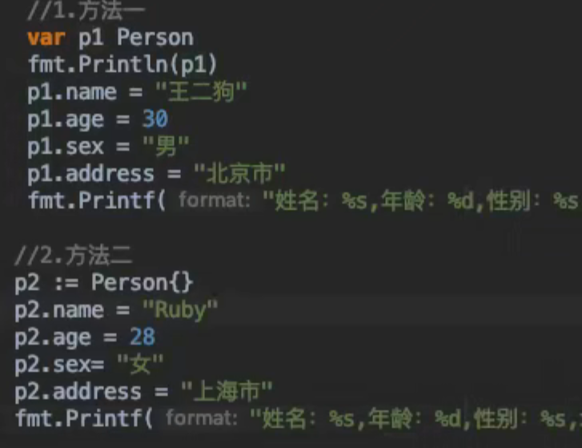  
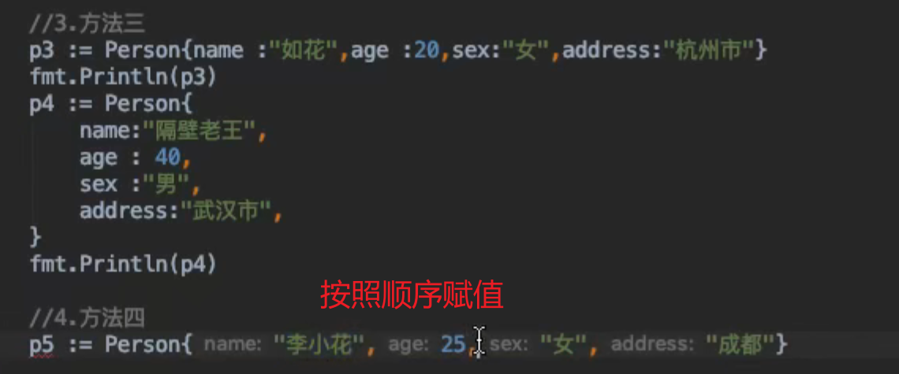  
如果不赋值,默认存储的是类型的0值

## 结构体指针
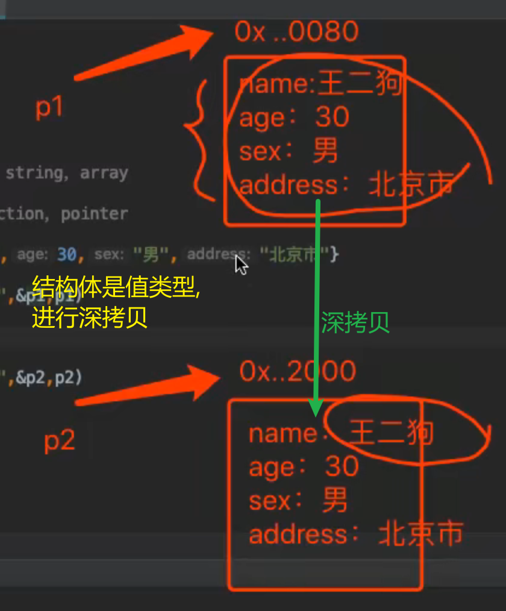  

### 定义结构体指针
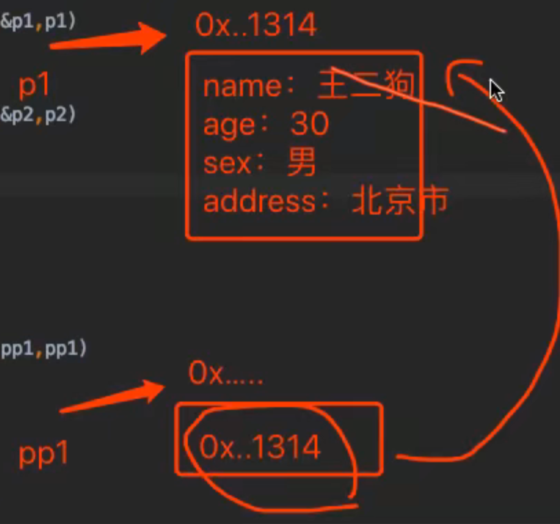  
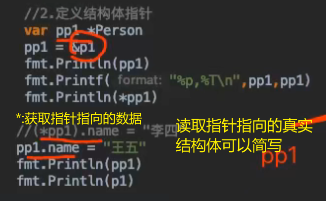  

### 通过 `new` 返回结构体指针
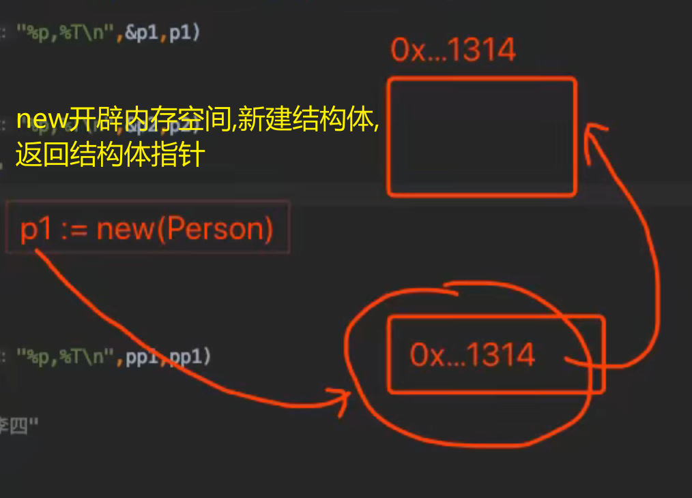  
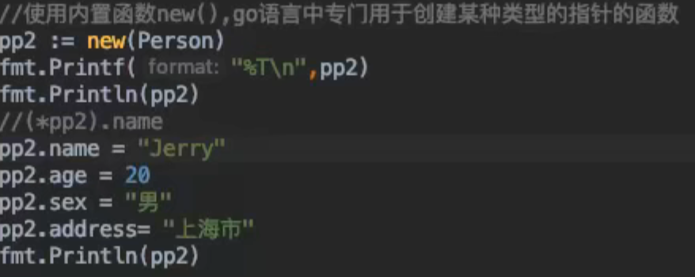  
通过指针：new(),不是 `nil`,空指针
指向了**新分配的类型的内存空间**，里面存该类型的0值.  
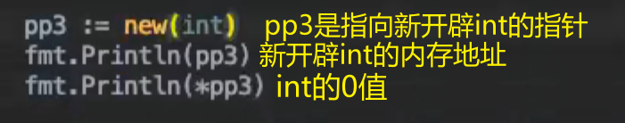  

## 结构体的匿名

### 匿名结构体
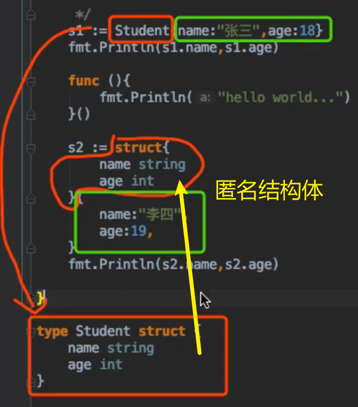  

### 结构体的匿名字段
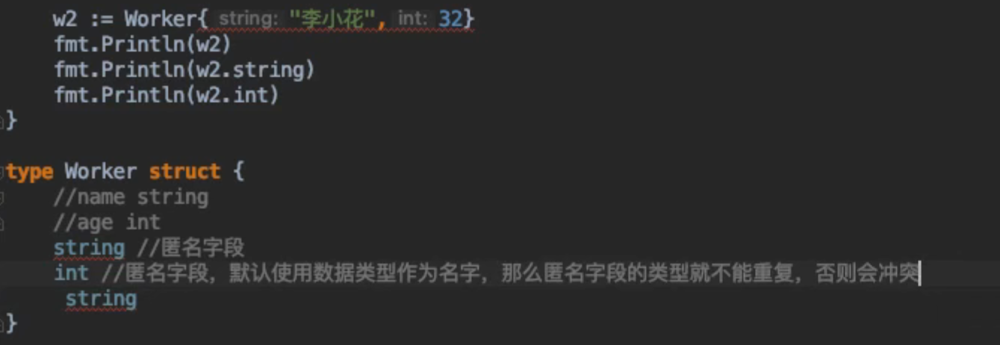  

## 结构体嵌套
一个结构体可能包含一个字段，而这个字段反过来就是一个结构体。这些结构被称为嵌套结构。
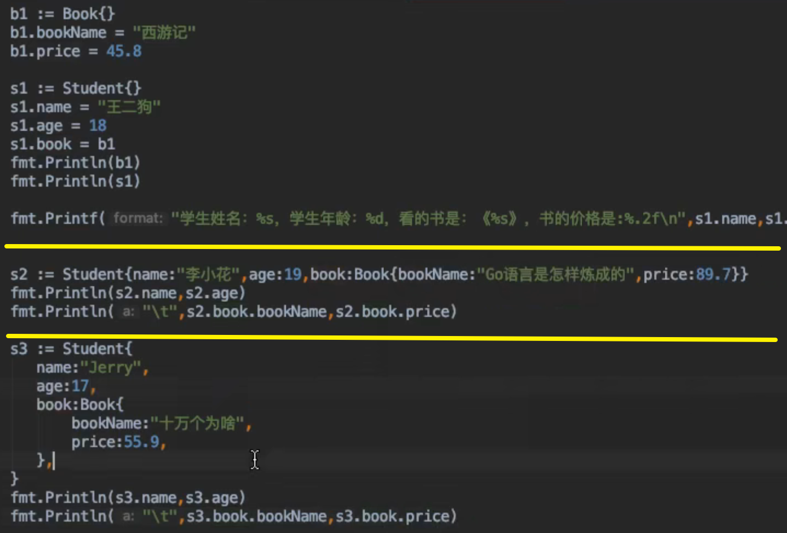  
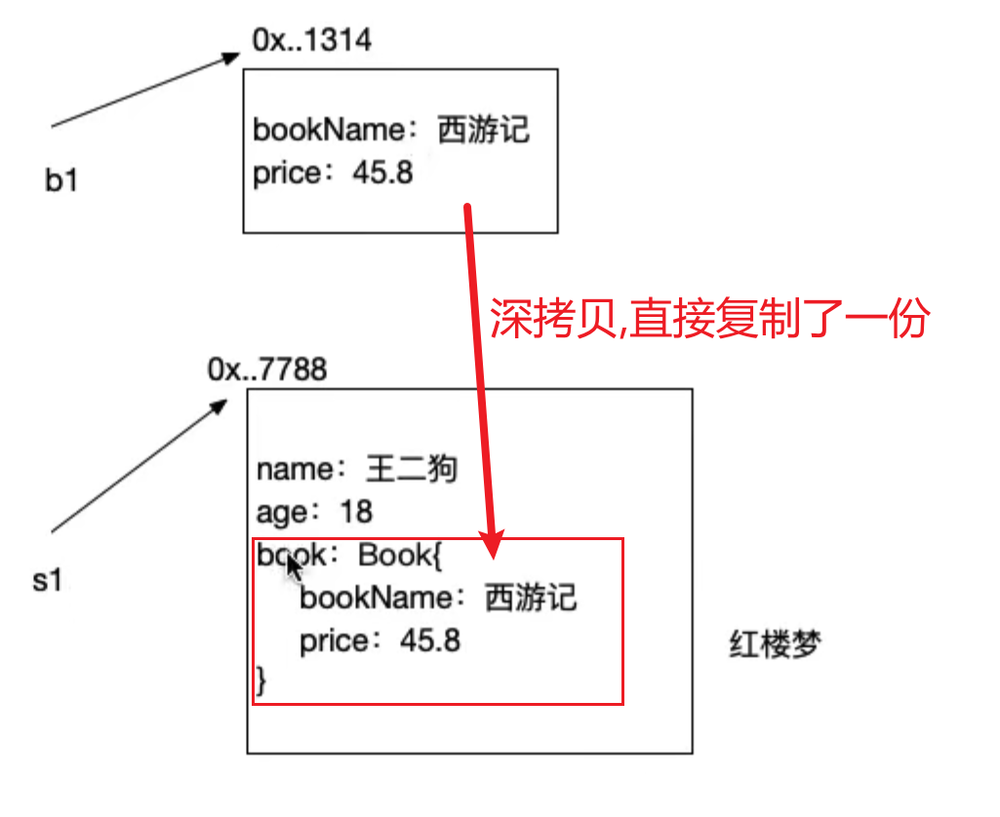  

### 将结构体的地址作为字段数值(引用传递) [建议使用]
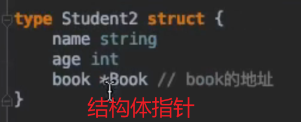  
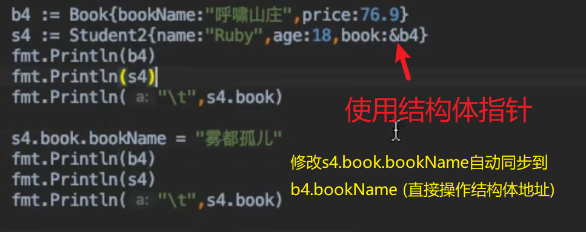  

## Golang 中的 OPP(面向对象)
> `Golang` 并不是面向对象的语言....但可以模拟继承性.

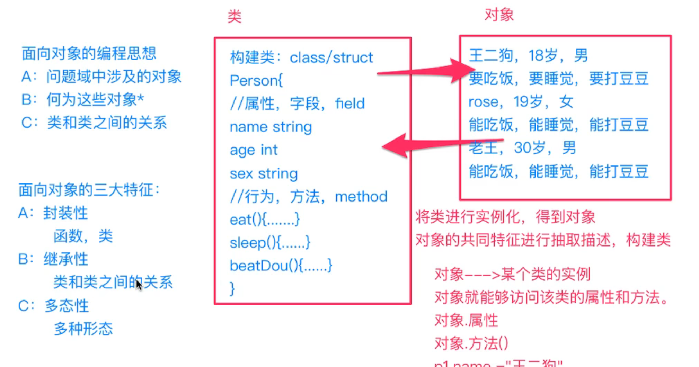  
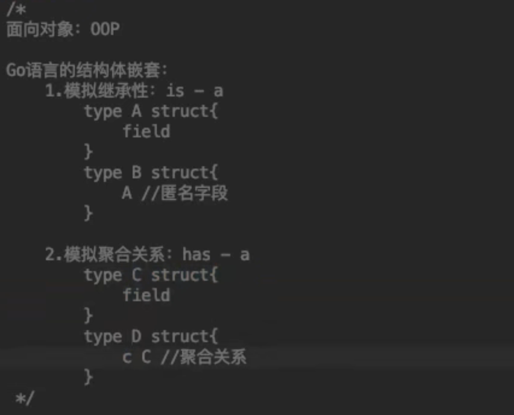  

### 通过结构体的嵌套模拟继承性
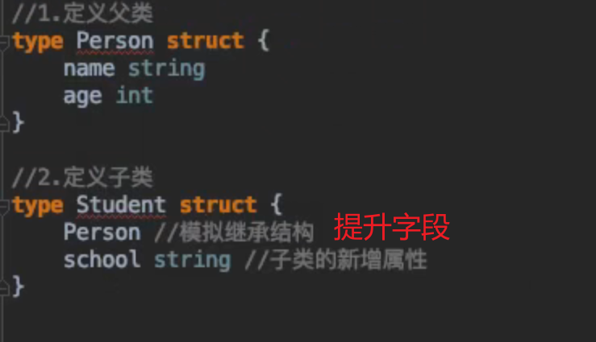  
`s3.Person.name->s3.name`  
Student 结构体将 Person 结构体作为一个匿名字段了.  
那么 Person 中的字段，对于 Student 来讲，就是提升字段.  
Student 对象直接访问 Person 中的字段
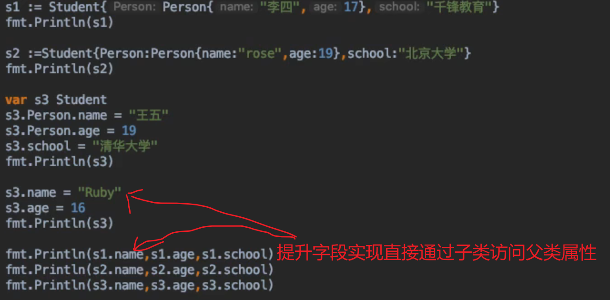  